# 🚗 RideShare Backend API

A full-stack ride-sharing backend application built with **Spring Boot**, **MongoDB**, and **JWT Authentication**. This project demonstrates clean architecture, role-based access control, input validation, and comprehensive error handling.

---

## 📋 Table of Contents

- [Features](#-features)
- [Tech Stack](#-tech-stack)
- [Architecture](#-architecture)
- [Getting Started](#-getting-started)
- [API Documentation](#-api-documentation)
- [Testing Guide](#-testing-guide)
- 📮 Postman Collection (Optional Testing)
- [Screenshots](#-screenshots)
- [Project Structure](#-project-structure)
- [Security](#-security)
- [Contributing](#-contributing)

---

## ✨ Features

### Core Functionality
- 🔐 **JWT Authentication** - Secure token-based authentication
- 👥 **Role-Based Access Control** - Separate permissions for Users and Drivers
- 🚕 **Ride Management** - Request, accept, and complete rides
- ✅ **Input Validation** - Jakarta Bean Validation for all inputs
- 🛡️ **Global Exception Handling** - Consistent error responses
- 📝 **Clean Architecture** - Controller → Service → Repository pattern

### User Features (ROLE_USER)
- Register and login
- Request rides with pickup and drop locations
- View personal ride history
- Complete rides

### Driver Features (ROLE_DRIVER)
- Register and login
- View all pending ride requests
- Accept rides
- Complete rides

---

## 🛠 Tech Stack

| Technology | Version | Purpose |
|-----------|---------|---------|
| **Java** | 17 | Programming Language |
| **Spring Boot** | 3.4.12 | Backend Framework |
| **Spring Security** | 6.x | Authentication & Authorization |
| **MongoDB** | Latest | NoSQL Database |
| **JWT (JJWT)** | 0.11.5 | Token Generation & Validation |
| **Maven** | 3.9+ | Build Tool |
| **Jakarta Validation** | 3.x | Input Validation |

---

## 🏗 Architecture

### System Architecture Diagram


### Entity Relationship Diagram


### Ride Lifecycle Flow


### Authentication Flow


### Ride Request Flow

```mermaid
sequenceDiagram
    participant User
    participant Driver
    participant API
    participant MongoDB
    
    User->>API: POST /api/v1/rides (create ride)
    API->>MongoDB: save ride (status: REQUESTED)
    MongoDB-->>API: ride created
    API-->>User: ride details
    
    Driver->>API: GET /api/v1/driver/rides/requests
    API->>MongoDB: find rides (status: REQUESTED)
    MongoDB-->>API: pending rides
    API-->>Driver: list of rides
    
    Driver->>API: POST /api/v1/driver/rides/{id}/accept
    API->>MongoDB: update ride (status: ACCEPTED, assign driverId)
    MongoDB-->>API: ride updated
    API-->>Driver: accepted ride
    
    Driver->>API: POST /api/v1/rides/{id}/complete
    API->>MongoDB: update ride (status: COMPLETED)
    MongoDB-->>API: ride completed
    API-->>Driver: completed ride
```



---

## 🚀 Getting Started

### Prerequisites

- ☕ Java 17 or higher
- 🍃 MongoDB installed and running
- 📦 Maven 3.9+
- 📮 Postman (for API testing)

### Installation

1. **Clone the repository**
   ```bash
   git clone https://github.com/Gaurakumar-s/rideshare-backend.git
   cd rideshare-backend
   ```

2. **Configure MongoDB**
   
   Make sure MongoDB is running on `localhost:27017`
   ```bash
   # Start MongoDB
   mongod
   ```

3. **Configure application properties**
   
   Update `src/main/resources/application.properties` if needed:
   ```properties
   server.port=8081
   spring.data.mongodb.uri=mongodb://localhost:27017/rideshare_db
   app.jwt.secret=mysupersecurejwtsecretkey_1234567890
   app.jwt.expiration-ms=3600000
   ```

4. **Build the project**
   ```bash
   ./mvnw clean install
   ```

5. **Run the application**
   ```bash
   ./mvnw spring-boot:run
   ```

6. **Verify the application is running**
   ```bash
   curl http://localhost:8081/ping
   # Expected response: OK
   ```

---

## 📚 API Documentation

### Base URL
```
http://localhost:8081
```

### API Endpoints

| Role | Method | Endpoint | Description |
|------|--------|----------|-------------|
| **PUBLIC** | POST | `/api/auth/register` | Register a new user/driver |
| **PUBLIC** | POST | `/api/auth/login` | Login and receive JWT token |
| **USER** | POST | `/api/v1/rides` | Create a new ride request |
| **USER** | GET | `/api/v1/user/rides` | Get all rides for logged-in user |
| **DRIVER** | GET | `/api/v1/driver/rides/requests` | View all pending ride requests |
| **DRIVER** | POST | `/api/v1/driver/rides/{id}/accept` | Accept a ride request |
| **USER/DRIVER** | POST | `/api/v1/rides/{id}/complete` | Mark a ride as completed |

---

## 🧪 Testing Guide

### 📮 Using Postman (Recommended)

We've included pre-configured Postman collection and environment for easy testing!

#### **Step 1: Import Files**

1. **Download the Postman files** from this repository:
   - `postman/RideShare_API_Collection.json` - All API requests
   - `postman/RideShare_Environment.json` - Environment variables

2. **Import into Postman:**
   - Open Postman
   - Click **"Import"** button (top-left)
   - Drag both JSON files or click "Upload Files"
   - Click **"Import"**

3. **Select Environment:**
   - Click the environment dropdown (top-right)
   - Select **"RideShare Local"**
   - ✅ You're ready to test!

#### **Step 2: What's Included**

The collection includes:
- ✅ **All API endpoints** pre-configured
- ✅ **Auto-token extraction** - Tokens save automatically after login
- ✅ **Environment variables** - `baseUrl`, `userToken`, `driverToken`, `rideId`
- ✅ **Organized folders** - Auth, User, Driver, Error Cases
- ✅ **Test scripts** - Automatic variable population

#### **Step 3: Test Flow**

Follow this sequence for complete testing:

##### **Step 1: Register Users**

**Register a User:**
```bash
POST http://localhost:8081/api/auth/register
Content-Type: application/json

{
  "username": "john3",
  "password": "1234",
  "role": "ROLE_USER"
}
```

**Register a Driver:**
```bash
POST http://localhost:8081/api/auth/register
Content-Type: application/json

{
  "username": "driver2",
  "password": "abcde",
  "role": "ROLE_DRIVER"
}
```

##### **Step 2: Login & Get Tokens**

**User Login:**
```bash
POST http://localhost:8081/api/auth/login
Content-Type: application/json

{
  "username": "john3",
  "password": "1234"
}

# Response:
{
  "token": "eyJhbGciOiJIUzI1NiIsInR5cCI6IkpXVCJ9...",
  "role": "ROLE_USER",
  "message": "User login successful"
}
```

**Driver Login:**
```bash
POST http://localhost:8081/api/auth/login
Content-Type: application/json

{
  "username": "driver2",
  "password": "abcde"
}

# Response:
{
  "token": "eyJhbGciOiJIUzI1NiIsInR5cCI6IkpXVCJ9...",
  "role": "ROLE_DRIVER",
  "message": "Driver login successful"
}
```

##### **Step 3: Create a Ride (User)**

```bash
POST http://localhost:8081/api/v1/rides
Authorization: Bearer {USER_TOKEN}
Content-Type: application/json

{
  "pickupLocation": "Koramangala",
  "dropLocation": "Indiranagar"
}

# Response:
{
  "id": "67a1234567890abcdef",
  "userId": "user_id_here",
  "driverId": null,
  "pickupLocation": "Koramangala",
  "dropLocation": "Indiranagar",
  "status": "REQUESTED",
  "createdAt": "2025-12-06T..."
}
```

##### **Step 4: Driver Views & Accepts Ride**

**View Pending Rides:**
```bash
GET http://localhost:8081/api/v1/driver/rides/requests
Authorization: Bearer {DRIVER_TOKEN}

# Response: Array of rides with status "REQUESTED"
```

**Accept a Ride:**
```bash
POST http://localhost:8081/api/v1/driver/rides/{rideId}/accept
Authorization: Bearer {DRIVER_TOKEN}

# Response: Ride object with status "ACCEPTED"
```

##### **Step 5: Complete Ride**

```bash
POST http://localhost:8081/api/v1/rides/{rideId}/complete
Authorization: Bearer {DRIVER_TOKEN}

# Response: Ride object with status "COMPLETED"
```

---
## 📮 Postman Collection (Optional Testing)

This project also includes a ready-to-use Postman setup for testing all APIs.

- Import the collection from: `postman/RideShare_API_Collection.json`
- Import the environment from: `postman/RideShare_Environment.json`
- Select the **RideShare Local** environment in Postman
- Run the requests in this order:
  1. Auth – Register User
  2. Auth – Register Driver
  3. Auth – Login User
  4. Auth – Login Driver
  5. User – Ride Create
  6. Driver – Pending Rides
  7. Driver – Accept Ride
  8. Ride – Complete
  9. User – My Rides

For a detailed step-by-step guide, see [`POSTMAN_GUIDE.md`](POSTMAN_GUIDE.md).

---

## 📸 Screenshots

### Authentication Flow

#### 1. Register User

*Successfully registering a new user with ROLE_USER*

#### 2. Register Driver

*Successfully registering a new driver with ROLE_DRIVER*

#### 3. User Login

*User login returning JWT token - Token is automatically saved to environment variable*

#### 4. Driver Login

*Driver login returning JWT token - Token is automatically saved to environment variable*

---

### User Ride Flow

#### 5. Create Ride Request

*User creates a ride request with pickup and drop locations*

#### 6. View My Rides

*User views their ride history filtered by userId*

---

### Driver Ride Flow

#### 7. View Pending Rides

*Driver views all rides with REQUESTED status*

#### 8. Accept Ride

*Driver accepts a ride - Status changes to ACCEPTED and driverId is assigned*

#### 9. Complete Ride

*Ride is marked as COMPLETED*

---

### Error Handling

#### 10. Validation Error (400)

*Validation error when required fields are empty or invalid*

#### 11. Unauthorized (401)

*Unauthorized error when no authentication token is provided*

#### 12. Forbidden (403)

*Forbidden error when user with wrong role tries to access endpoint (USER trying to access DRIVER endpoint)*

---

## 📁 Project Structure

```
rideshare/
├── postman/                              # 📮 Postman Collection & Environment
│   ├── RideShare_API_Collection.json    # All API endpoints
│   └── RideShare_Environment.json       # Environment variables
├── screenshots/                          # 📸 API Testing Screenshots
│   ├── 01-register-user.png
│   ├── 02-register-driver.png
│   ├── 03-login-user.png
│   ├── 04-login-driver.png
│   ├── 05-create-ride.png
│   ├── 06-get-my-rides.png
│   ├── 07-pending-rides.png
│   ├── 08-accept-ride.png
│   ├── 09-complete-ride.png
│   ├── 10-validation-error.png
│   ├── 11-unauthorized.png
│   └── 12-forbidden.png
├── src/
│   ├── main/
│   │   ├── java/com/example/rideshare/
│   │   │   ├── config/
│   │   │   │   ├── JwtAuthFilter.java
│   │   │   │   └── SecurityConfig.java
│   │   │   ├── controller/
│   │   │   │   ├── AuthController.java
│   │   │   │   ├── DriverRideController.java
│   │   │   │   ├── RideController.java
│   │   │   │   └── PingController.java
│   │   │   ├── dto/
│   │   │   │   ├── AuthResponse.java
│   │   │   │   ├── CreateRideRequest.java
│   │   │   │   ├── LoginRequest.java
│   │   │   │   └── RegisterRequest.java
│   │   │   ├── exception/
│   │   │   │   ├── BadRequestException.java
│   │   │   │   ├── GlobalExceptionHandler.java
│   │   │   │   └── NotFoundException.java
│   │   │   ├── model/
│   │   │   │   ├── Ride.java
│   │   │   │   └── User.java
│   │   │   ├── repository/
│   │   │   │   ├── RideRepository.java
│   │   │   │   └── UserRepository.java
│   │   │   ├── service/
│   │   │   │   ├── AuthService.java
│   │   │   │   ├── CustomUserDetailsService.java
│   │   │   │   └── RideService.java
│   │   │   ├── util/
│   │   │   │   └── JwtUtil.java
│   │   │   └── RideshareApplication.java
│   │   └── resources/
│   │       └── application.properties
│   └── test/
├── .gitignore
├── pom.xml
└── README.md
└── POSTMAN_GUIDE.md
```

---

## 🔒 Security

### JWT Token Structure

**Token Claims:**
```json
{
  "sub": "username",
  "role": "ROLE_USER" or "ROLE_DRIVER",
  "iat": 1638360000,
  "exp": 1638363600
}
```

### Security Features

- ✅ **BCrypt Password Encryption** - Passwords are never stored in plain text
- ✅ **JWT Token Authentication** - Stateless authentication
- ✅ **Role-Based Authorization** - `@PreAuthorize` on sensitive endpoints
- ✅ **CSRF Protection** - Disabled for stateless API (JWT-based)
- ✅ **Stateless Session** - No server-side session storage
- ✅ **Input Validation** - Jakarta Bean Validation on all DTOs

### Authorization Rules

| Endpoint Pattern | Allowed Roles |
|-----------------|---------------|
| `/api/auth/**` | PUBLIC (all) |
| `/api/v1/rides` (POST) | ROLE_USER |
| `/api/v1/user/**` | ROLE_USER |
| `/api/v1/driver/**` | ROLE_DRIVER |
| `/api/v1/rides/{id}/complete` | ROLE_USER or ROLE_DRIVER |

---

## 🐛 Error Responses

All error responses follow a consistent format:

```json
{
  "error": "ERROR_TYPE",
  "message": "Human-readable error message",
  "timestamp": "2025-12-06T12:34:56.789Z"
}
```

### Error Types

| Status Code | Error Type | Description |
|------------|------------|-------------|
| 400 | `VALIDATION_ERROR` | Input validation failed |
| 400 | `BAD_REQUEST` | Invalid request (e.g., wrong ride status) |
| 401 | `UNAUTHORIZED` | Missing or invalid authentication token |
| 403 | `FORBIDDEN` | User doesn't have permission for this action |
| 404 | `NOT_FOUND` | Resource not found |
| 500 | `INTERNAL_ERROR` | Server error |

---

## 📊 Database Schema

### Users Collection
```javascript
{
  "_id": ObjectId,
  "username": String,      // unique
  "password": String,      // BCrypt hashed
  "role": String          // "ROLE_USER" or "ROLE_DRIVER"
}
```

### Rides Collection
```javascript
{
  "_id": ObjectId,
  "userId": String,        // Reference to User._id
  "driverId": String,      // Reference to Driver._id (nullable)
  "pickupLocation": String,
  "dropLocation": String,
  "status": String,        // "REQUESTED", "ACCEPTED", "COMPLETED"
  "createdAt": Date
}
```

---

## 🧪 Testing with cURL

### Quick Test Commands

```bash
# 1. Register User
curl -X POST http://localhost:8081/api/auth/register \
  -H "Content-Type: application/json" \
  -d '{"username":"john","password":"1234","role":"ROLE_USER"}'

# 2. Login User
curl -X POST http://localhost:8081/api/auth/login \
  -H "Content-Type: application/json" \
  -d '{"username":"john","password":"1234"}'

# Save the token from response, then:

# 3. Create Ride
curl -X POST http://localhost:8081/api/v1/rides \
  -H "Authorization: Bearer YOUR_TOKEN_HERE" \
  -H "Content-Type: application/json" \
  -d '{"pickupLocation":"Koramangala","dropLocation":"Indiranagar"}'

# 4. Get My Rides
curl -X GET http://localhost:8081/api/v1/user/rides \
  -H "Authorization: Bearer YOUR_TOKEN_HERE"
```

---

## 🚦 API Status Codes

| Code | Meaning | When |
|------|---------|------|
| 200 | OK | Successful GET/POST/PUT |
| 201 | Created | Resource created successfully |
| 400 | Bad Request | Validation error or invalid input |
| 401 | Unauthorized | Missing/invalid token |
| 403 | Forbidden | Valid token but insufficient permissions |
| 404 | Not Found | Resource doesn't exist |
| 500 | Internal Server Error | Unexpected server error |

---

## 🔧 Configuration

### Environment Variables (Optional)

You can override application.properties with environment variables:

```bash
export SERVER_PORT=8081
export MONGODB_URI=mongodb://localhost:27017/rideshare_db
export JWT_SECRET=your_secret_key_here
export JWT_EXPIRATION=3600000
```

### JWT Configuration

| Property | Default | Description |
|----------|---------|-------------|
| `app.jwt.secret` | (see properties) | Secret key for JWT signing |
| `app.jwt.expiration-ms` | 3600000 | Token validity (1 hour in ms) |

---


## 🎯 Future Enhancements

- [ ] Add real-time notifications using WebSockets
- [ ] Implement ride rating system
- [ ] Add geolocation services
- [ ] Create admin dashboard
- [ ] Add payment integration
- [ ] Implement ride history analytics
- [ ] Add driver availability status
- [ ] Create mobile app integration endpoints

---


